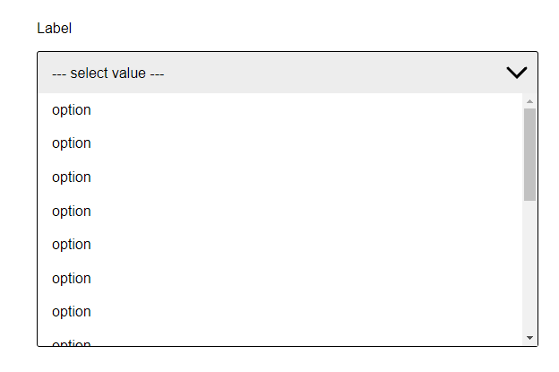
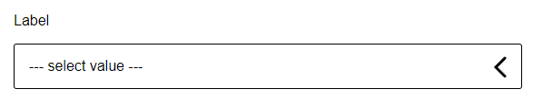

# react-customSelectDropdown
============
Customisable dropdown select react component





- [Features](#features)
- [Installing](#installing)
- [Quick Start](#quick-start)
- [Props](#props)
    - [Interval](#interval)
    - [Formatting](#formatting)
    - [Parsing Dates](#parsing-dates)
    - [Add and Subtract](#add-and-subtract)
    - [From Now](#from-now)
    - [From Now During](#from-now-during)

### Features

- configurable via `prop`s

### Installing

> `npm install --save react-dropdown`


### Quick Start

```jsx
import React  from 'react';
import SelectDropdown from 'react-customSelectDropdown';

export default class MyComponent extends React.Component {
    render() {
        return (
            <SelectDropdown options={options}/>
        );
    }
}
```

Outputs:

```html
<label for="Label" class="mainLabel__lib-EM">Label</label>
<select name="Label" id="Label-select" class="select__lib-EM">
    <option value="1">Option 1</option>
    <option value="2">Option 2</option>
    <option value="3">Option 3</option>
</select>
<div class="dropdown__lib-EM close">
  <div class="select-label__lib-EM close">
    <span class="placeholder__lib-EM">placeholder value</span>
    <div class="arrow__lib-EM">
      <svg width="48px" height="48px"><path d="M 30,35 L 20,25 L30,15" stroke-width="3" stroke-linecap="round" style="fill: none; stroke: black;"></path></svg>
    </div>
  </div>
  <ul class="dropdown__deroulant__lib-EM close">
    <li class="dropdown__option__lib-EM" value="option">
      <span>Option 1</span>
    </li>
        <li class="dropdown__option__lib-EM" value="option">
      <span>Option 2</span>
    </li>
        <li class="dropdown__option__lib-EM" value="option">
      <span>Option 3</span>
    </li>
  </ul>
</div>
```

### Usage

import:

```bash
import Dropdown from "react-customSelectDropdown";
```
```

``

and use as:

```jsx
<Select label={label} options={options} />
```

> **label** and **options** are the minimum required props

#### How to get the returned value ?

*You can get the returned value by listenting the event **onSelectDropdownOption***

