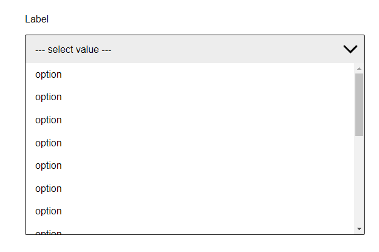
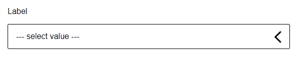

# [react-customSelectDropdown](https://github.com/EloiMgn/react-component-dropdown)

Customisable select dropdown for React 





- [Features](#features)
- [Installing](#installing)
- [Quick Start](#quick-start)
- [Props](#props)
    - [options](#options)
    - [label](#label)
    - [placeholder](#placeholder)
    - [startValue](#startValue)
    - [fontFamily](#fontFamily)
    - [hoverTextColor](#hoverTextColor)
    - [hoverBackground](#hoverBackground)
- [License](#license)

## Features

- Accessibility friendly
- Native select
- configurable via `prop`s

## Installing

The package can be installed via [npm](https://github.com/npm/cli):

```
npm install react-customSelectDropdown --save
```

Or via [yarn](https://github.com/yarnpkg/yarn):

```
yarn add react-customSelectDropdown
```


## Quick Start

```jsx
import React  from 'react';
import SelectDropdown from 'react-customSelectDropdown';

export default class MyComponent extends React.Component {
    render() {
        return (
            <SelectDropdown options={options}/>
        );
    }
}
```

Outputs:

```html
<label for="Label" class="mainLabel__lib-EM">Label</label>
<select name="Label" id="Label-select" class="select__lib-EM">
    <option value="1">Option 1</option>
    <option value="2">Option 2</option>
    <option value="3">Option 3</option>
</select>
<div class="dropdown__lib-EM close">
  <div class="select-label__lib-EM close">
    <span class="placeholder__lib-EM">placeholder value</span>
    <div class="arrow__lib-EM">
      <svg width="48px" height="48px"><path d="M 30,35 L 20,25 L30,15" stroke-width="3" stroke-linecap="round" style="fill: none; stroke: black;"></path></svg>
    </div>
  </div>
  <ul class="dropdown__deroulant__lib-EM close">
    <li class="dropdown__option__lib-EM" value="option">
      <span>Option 1</span>
    </li>
    <li class="dropdown__option__lib-EM" value="option">
      <span>Option 2</span>
    </li>
    <li class="dropdown__option__lib-EM" value="option">
      <span>Option 3</span>
    </li>
  </ul>
</div>
```

## Usage

import:

```bash
import Dropdown from "react-customSelectDropdown";
```

and use as:

```jsx
<SelectDropdown options={options} />
```

### How to get the returned value ?

*You can get the returned value by listenting the event **onSelectDropdownOption***

## Props

The component supports the following props. All props  are optionals except the *options* prop.

### options (required)
_options={array}_

The *options* prop is required so the component can render the dropdown list.

The options prop is an array of objects. Each object must have the following properties: *name* with the option name that you want to show on the dropdown list.

```
const states = [
  {
    "name": "option",
  }
  {
    "name": "option",
  }
  {
    "name": "option",
  }
];
```
### label
_label={string}_

By default the component will not show a label but if you want you can set a label by adding the prop *label*

Set the label as "label"
```jsx
import React  from 'react';
import SelectDropdown from 'react-customSelectDropdown';

export default class MyComponent extends React.Component {
    render() {
        return (
            <SelectDropdown label="label" options={options} />
        );
    }
}
```

### placeholder
_placeholder={string}_

By default the component will not show any placeholder but if you want you can set it by adding the prop *placeholder*

Set the placeholder as "placeholder"
```jsx
import React  from 'react';
import SelectDropdown from 'react-customSelectDropdown';

export default class MyComponent extends React.Component {
    render() {
        return (
            <SelectDropdown placeholder="placeholder" options={options} />
        );
    }
}
```

### startValue
_startvalue={string}_

By default the component doesn't have startvalue and the user have to select one so a value is returned but, if you want to set a default startValue from the options list you can add the prop *startValue* with a string that matches the name of the option you want to set as startValue.

Set the startValue as "option 3"
```jsx
import React  from 'react';
import SelectDropdown from 'react-customSelectDropdown';

export default class MyComponent extends React.Component {
    render() {
        return (
            <SelectDropdown starValue="option 3" options={options} />
        );
    }
}
```
:warning: if you set a startValue the placeholder will be overwritten by the startValue

### fontFamily
_fontFamily={string}_

By default the component font family is **Arial, Helvetica, sans-serif;** but if you want you can set a font family by adding the prop *fontFamily*

### hoverTextColor
_hoverTextColor={string}_

By default the component hover text color is **#121212** but if you want you can set a hover text color by adding the prop *hoverTextColor*

### hoverBackground
_hoverBackground={string}_

By default the component hover background color is **#8d8d8d28** but if you want you can set a hover background color by adding the prop *hoverBackground*

## License

Copyright (c) 2022 Eloi Magnien. Licensed under MIT license, see [LICENSE](LICENSE) for the full license.